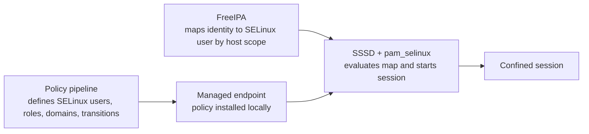
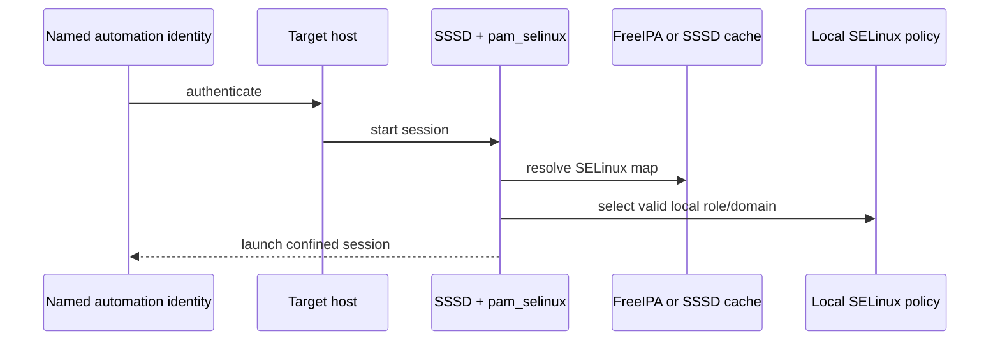
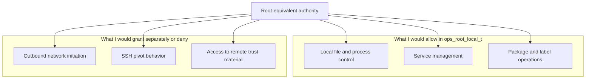
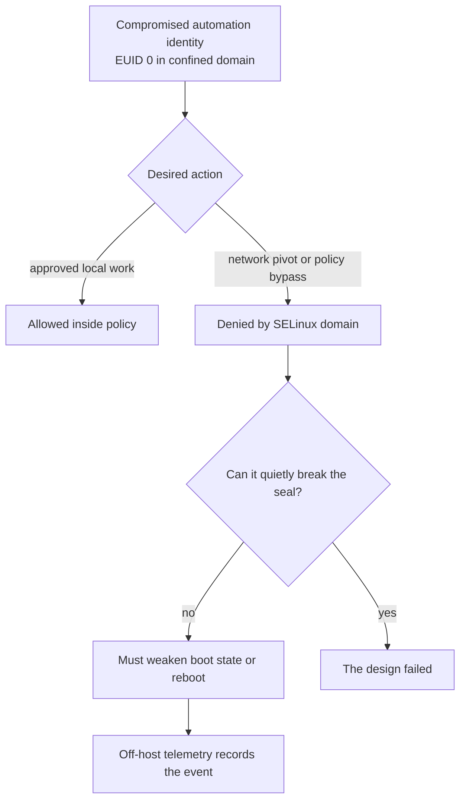
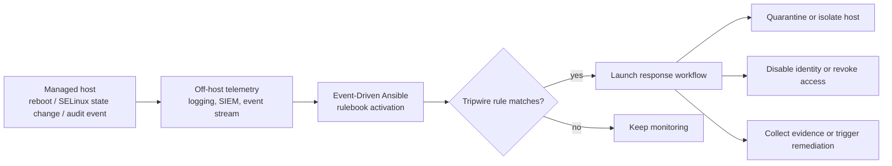

# SELinux-Confined Automation, FreeIPA Mapping, and Root Re-assembly

## The Argument

I think the default trust model for automation is wrong.

On RHEL, a lot of shipped software already benefits from targeted SELinux confinement, but logged-in users are still unconfined by default and typically map to `unconfined_u`. I do not think that model scales well for orchestration. It makes sense for a person at a shell who is expected to improvise, inspect, and recover. It makes much less sense for automation, where the normal pattern is to start with broad trust and then pivot through `sudo`, SSH, and existing credentials.

I do not want automation to inherit the same assumptions as a human operator and then move faster. I want automation to start constrained, and I want any movement out of that constraint to be narrow, deliberate, and visible.

The shape of the design I have in mind is simple:
- the endpoint carries the actual SELinux policy
- FreeIPA maps named identities into those SELinux users and roles
- SSSD and `pam_selinux` apply that mapping at login
- the role can include local root-equivalent powers without automatically including network pivot rights
- bypassing the confinement boundary should be noisy enough to trigger a response

I think that is a better model for modern automation than treating orchestration as an unconfined person with faster hands.

## What FreeIPA Actually Gives

I do not think FreeIPA is the place to author SELinux policy. I think it is the right place to map identity into policy that already exists on the endpoints.

That distinction matters. The FreeIPA and Red Hat IdM documentation describe SELinux user maps as a way to associate:
- an SELinux user
- an IdM user or group
- a host or host group
- or an HBAC-linked scope that provides the user and host side of the match

I read that as a clean control-plane boundary. FreeIPA answers the question, "On this host, which SELinux user should this identity get?" It does not answer, "What is the SELinux policy for this host?" That second question belongs to the policy pipeline and the endpoint.

SSSD evaluates the map on the client, and `pam_selinux` launches the session in the chosen context. Specificity and configured order matter. Direct user mappings beat group mappings. Direct host scope beats broader host-group scope. If nothing more specific matches, order and defaults decide what happens.

That is enough centralization. FreeIPA does not need to become a policy engine. I need it to be the place where identity lands in the right confinement at scale.

## Where the Default Model Breaks Down

The default model assumes that it is acceptable to begin from a broadly trusted user context and rely on procedure to keep that trust from spreading too far.

I do not think that assumption survives contact with modern automation.

If an automation identity is compromised, the problem is not just that it can do one local task incorrectly. The problem is that the identity often inherits a whole operator model:
- broad shell access
- `sudo`
- outbound network access
- SSH client behavior
- pivoting through the node
- access to local trust material

That is too much ambient authority.

Red Hat's own documentation already points to the gap. On one side, targeted SELinux is doing real work for services. On the other side, interactive user sessions are usually unconfined. I think automation has been living on the wrong side of that line.

## Why This Matters More Now

I also think this needs to be understood as a response to a different class of attacker than the one a lot of operational models were built around.

The VoidLink reporting from Check Point Research is a useful marker for that shift. They describe it as a cloud-first Linux malware framework designed for modern infrastructure, with explicit awareness of major cloud environments, Kubernetes, and Docker, plus credential harvesting for cloud and version-control contexts. They also describe a broad plugin-based framework, multiple C2 channels, and strong operational security features. Their report does not literally say "this is an orchestration attack framework," but I think that is a fair directional inference from the cloud-native, container-aware design and the attention to software-engineer and infrastructure-adjacent credentials.

What matters is the change in assumptions this forces. If attackers are building cloud-first, modular, rapidly evolving tooling for Linux infrastructure, then I do not think it is enough to harden only the network edge and trust orchestration once it is inside. I need to assume that automation identities, orchestration paths, and control-plane hosts are part of the attack surface. In that world, reducing pivot rights and re-assembling root inside confinement stops looking academic and starts looking practical.

## The Model I Want

I want a small set of organization-defined SELinux users and domains for automation. I want those shipped to the endpoints through a policy pipeline. I want FreeIPA to map identities into them. I want the baseline role to be function-specific and narrow.

That means I would rather have a small taxonomy like this:
- `ops_inventory_u`
- `ops_backup_u`
- `ops_patch_u`
- `ops_deploy_u`
- `ops_root_local_u`
- `ops_root_networked_u`
- `ops_breakglass_u`

I do not want one SELinux user per tool. I want a few roles that reflect function and risk.

I also want host scope to matter. A deployment identity should not necessarily land in the same SELinux user on a build host, an application host, and a bastion. FreeIPA already gives me the host-sensitive mapping layer for that.

## Root Re-assembly

The other idea I want to push is that I do not think of `root` as a single thing anymore. I think of it as a bundle that can be split apart and reassembled under SELinux policy.

What matters to me is not EUID 0 in the abstract. What matters is which powers are actually present in the SELinux domain wrapped around that process. Red Hat's confined administrator patterns are enough to show that Unix identity is not the whole story. SELinux context still matters when a session is performing root-like work.

I want to be able to say that an automation role has local root-equivalent power without automatically saying that it has:
- arbitrary outbound networking
- SSH pivot rights
- access to every secret or agent socket on the node
- a free path to turn one compromise into fleet movement

That is the split I care about. Local administrative power, network initiation, pivot behavior, and tamper capability are separate grants.

I think this matters because too much automation today assumes that if something needs to act as root on a box, then it also gets to act as a networked operator from that box. I do not buy that as a default.

## Why I Would Not Build This Around Shared Direct `root`

There is an important control-plane distinction here.

FreeIPA maps IdM identities. A literal shared local `root` account does not fit that model cleanly. I think the cleaner pattern is:
- authenticate as a named automation identity
- map that identity through FreeIPA into a confined SELinux user
- transition to EUID 0 where required while preserving the SELinux confinement boundary

That gives me most of what I want: root-equivalent local authority without giving up identity, attribution, or centralized mapping.

If someone insists on direct shared `root` login everywhere, then most of the interesting control has to move back into local policy and local login handling. At that point the FreeIPA story gets weaker.

## Why This Matters for Ansible

Ansible is a good example because it makes the tradeoff obvious.

I want to be able to log into a host for automation, perform local administrative work, and still deny that session the ability to become a general-purpose jump point.

In the model I have in mind, a host could accept a named automation identity that ends up running tasks with EUID 0, but the session would still land in something like `ops_root_local_u:ops_root_local_r:ops_root_local_t`.

That would let the task do local things I actually care about:
- write approved configuration
- restore or apply labels where policy allows it
- restart approved services
- perform approved package work

What I do not want that same session to do by default is:
- open arbitrary outbound TCP sessions
- SSH onward to other nodes
- relay through the host as a jump point
- repurpose local trust material for movement unrelated to the task

That is the blast radius reduction I am after.

## Sealed Policy and Reboot-as-Tripwire

I also think this model gets more interesting when I stop at runtime confinement and ask a second question: what has to happen if someone wants to break out of it?

On a stock RHEL system, `root` can still do things that matter here. It can change SELinux mode at runtime with `setenforce`. It can install or override policy modules with `semodule`. It can weaken SELinux at boot through configuration or kernel parameters such as `enforcing=0` or `selinux=0`.

So I do not want to overclaim. SELinux by itself does not give me a sealed anti-tamper story.

What I am proposing is stronger and more explicit than that:
- runtime confinement comes from SELinux policy
- anti-tamper value comes from treating production policy as sealed state
- bypassing that seal should require a higher-friction action
- the bypass event should be visible outside the host

The reason the reboot angle works for me is that it is a reasonable tripwire. If the practical way to weaken or bypass the sealed runtime policy is to cross a boot-state boundary, then the attacker has to trade stealth for power. I can live with that if the event is visible off-host and the organization is prepared to react to it.

I do not need perfect prevention here. I need the cost of bypass to go up and the visibility of bypass to go up with it.

## Why Event-Driven Response Matters

I do not think the tripwire idea is complete if it ends at detection. If the seal-break event is visible outside the host, I want the rest of the system to react to it automatically. This is where Event-Driven Ansible becomes useful to me. Red Hat's Event-Driven Ansible model is built around rulebooks, decision environments, and controller integrations that react to incoming events and trigger automation in response.

What I want is:
- reboot events
- boot-state changes
- shipped audit records
- other off-host telemetry about policy weakening

to become event sources for response automation.

Possible reactions are straightforward:
- quarantine the host from normal automation inventories
- isolate the host through approved network-control workflows
- revoke or disable the identity associated with the event
- launch evidence collection or forensic preservation
- require break-glass recovery before the host is trusted again

That is how the tripwire stops being passive detection and becomes active containment.

## Guardrails

If I were trying to make this real, I would hold the line on a few things.

- I would not let automation silently fall back to a broad default like `unconfined_u` without review.
- I would not publish custom policy that has only been exercised in permissive mode.
- I would not create a new SELinux user for every tool just because it is easy to name one.
- I would not allow every automation role to transition into `sysadm_r:sysadm_t` or anything equivalent by default.
- I would not treat break-glass paths as normal plumbing.
- I would not talk about sealing unless the off-host visibility and response path are actually real.

## How I Would Pilot It

I would start small.

First I would validate the mapping path with something like `ops_inventory_u` on a non-production host class. Then I would add a constrained write-capable role like `ops_deploy_u` for one application tier. Only after that would I pilot `ops_root_local_u` on a workflow that genuinely needs local root-equivalent behavior but does not need to pivot through the host.

That order matters to me:
- prove the identity-to-context mapping path
- prove a confined role that can still do useful work
- then prove root re-assembly without network sprawl

I would leave break-glass and broader networked root-equivalent roles for later.

## Where I Land

I do not think the right question is whether SELinux can make automation perfectly safe. I think the right question is whether it can force automation into a much narrower and more legible trust model.

I think it can. FreeIPA provides the mapping layer. Endpoint policy provides the enforcement boundary. SELinux gives me a way to break root into pieces instead of treating it as a total trust state. Sealing and off-host telemetry make bypass visible. Event-Driven Ansible gives me a way to respond when that tripwire fires.

That combination feels much closer to the model I want than the one I inherited.

## Sources

- FreeIPA, SELinux user mapping model and precedence: https://www.freeipa.org/page/SELinux_user_mapping
- Red Hat, IdM SELinux mapping concepts: https://docs.redhat.com/en/documentation/red_hat_enterprise_linux/6/html/identity_management_guide/mapping-selinux
- Red Hat, IdM SELinux order and default behavior: https://docs.redhat.com/en/documentation/red_hat_enterprise_linux/7/html/linux_domain_identity_authentication_and_policy_guide/config-selinux
- Red Hat, IdM and SELinux login flow with SSSD and `pam_selinux`: https://docs.redhat.com/en/documentation/red_hat_enterprise_linux/7/html/selinux_users_and_administrators_guide/chap-managing_confined_services-identity_management
- Red Hat, confined and unconfined users, including `user_u`, `staff_u`, and `sysadm_u`: https://docs.redhat.com/en/documentation/red_hat_enterprise_linux/10/html/using_selinux/managing-confined-and-unconfined-users
- Red Hat, SELinux modes and runtime state changes with `setenforce`: https://docs.redhat.com/en/documentation/red_hat_enterprise_linux/9/html/using_selinux/changing-selinux-states-and-modes_using-selinux
- Red Hat, SELinux modes, boot-time changes, and kernel parameters such as `enforcing=0` and `selinux=0`: https://docs.redhat.com/en/documentation/red_hat_enterprise_linux/10/html/using_selinux/changing-selinux-states-and-modes
- Red Hat, local SELinux policy module installation and override with `semodule`: https://docs.redhat.com/es/documentation/red_hat_enterprise_linux/7/html/selinux_users_and_administrators_guide/security-enhanced_linux-prioritizing_selinux_modules
- Red Hat, confined user roles and network-limited patterns such as `guest_r` and `xguest_r`: https://docs.redhat.com/en/documentation/red_hat_enterprise_linux/9/html/using_selinux/managing-confined-and-unconfined-users_using-selinux
- Red Hat Ansible Automation Platform, Event-Driven Ansible controller, rulebook activations, decision environments, and integration with automation controller: https://access.redhat.com/documentation/en-us/red_hat_ansible_automation_platform/2.4/pdf/event-driven_ansible_controller_user_guide/red_hat_ansible_automation_platform-2.4-event-driven_ansible_controller_user_guide-en-us.pdf
- Check Point Research, VoidLink as a cloud-first Linux malware framework with cloud and container awareness: https://research.checkpoint.com/2026/voidlink-the-cloud-native-malware-framework/
